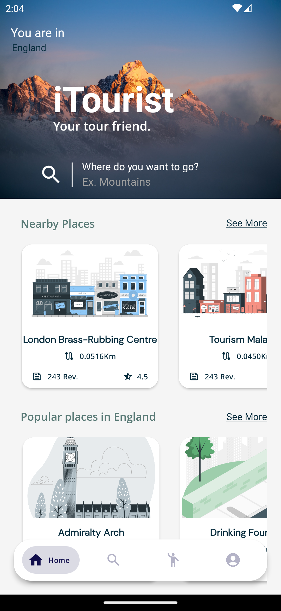

## I Tourist - Your Ultimate City Exploration Companion

I Tourist is a state-of-the-art Android native application, crafted to transform the way tourists engage with and discover new cities. Boasting an intuitive user interface and a comprehensive array of features, I Tourist redefines your travel experiences by providing effortless access to invaluable insights and personalized guidance.

# Features
- Discover Popular Places: Effortlessly explore a city's must-see attractions with I Tourist. Receive recommendations for the hottest destinations every traveler should include in their journey.

- Find Nearby Gems: Don't overlook hidden treasures just around the corner. Our app ensures you uncover nearby points of interest, guaranteeing an enriched city experience.

- Tailored Categories: Customize your exploration by selecting from an array of categories such as historical landmarks, culinary delights, shopping districts, and more. I Tourist ensures you discover places aligned with your preferences.

- In-Depth Information: Whether you're on-site or planning from afar, I Tourist provides comprehensive details about cities and their attractions, empowering you to plan your itinerary with confidence.

- Personalized Profile: Your I Tourist profile functions as your personal travel journal. Keep track of visited locations, mark favorites, and manage your personal information conveniently within the app.

- Book Your Tour Guide: Elevate your understanding with a deeper and more immersive encounter by booking a knowledgeable tour guide through I Tourist. Gain insights into the city's culture, history, and local perspectives.

- Interactive Chat: Need real-time advice or recommendations? Engage in direct conversations with your tour guide through our integrated chat section.

# Getting Started
To embark on your I Tourist journey, follow these simple steps:

Clone the Repository: Initiate by cloning this repository to your local machine.
bash
Copy code
git clone https://github.com/Abdelrahman-Elwardany1/ITourist
Installation: Navigate to the project directory and install the required dependencies.
bash
Copy code
cd i-tourist
./gradlew assembleDebug
Run the App: Launch the app on your preferred Android emulator or physical device.

Explore and Contribute: Delve into the source code, explore the features, and contribute to enhance I Tourist's offerings for fellow travelers.

## Technologies Used
- Android Native Development
- Kotlin
- Firebase (for chat functionality)
- Google Maps API
- Contributing
- We wholeheartedly welcome contributions from all developers! To contribute, follow these steps:

Fork the repository.
- Create a new branch for your feature or bug fix.
- Commit your changes and push them to your fork.
- Create a pull request, providing comprehensive details about your modifications and enhancements.
- Let's collaborate to create the ultimate city exploration companion!
